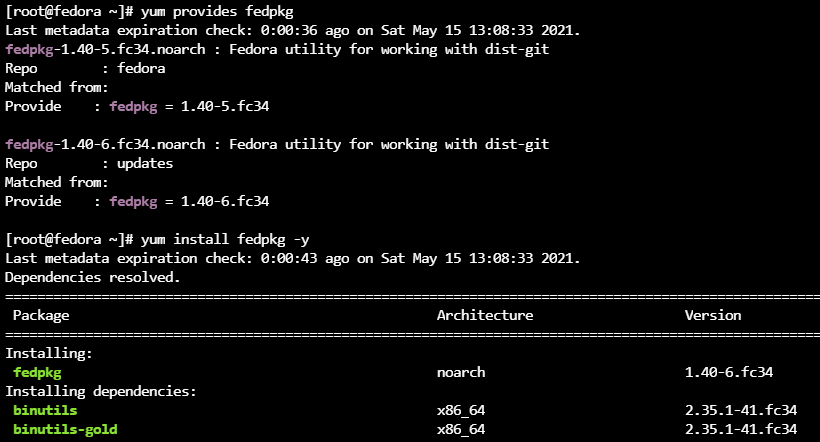
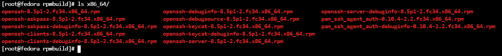

# 源码构建

## fedpkg

* fedora官方包工具软件fedpkg，了解一下
* fedpkg是Fedora社区的代码管理工具，它是 基于一系列现有工具（git/curl/diff等）的基础上，封装了这一系列命令，满足其代码管控的需求。
* fedpkg封装了git、mock、rpmbuild和mock前端，并提供了一些独有的命令来实现tarball和git仓库的关联。




### 编包流程

```
rpm -qif /PATH/TO/FILE  | grep 'Source RPM'
fedpkg co -a XXXX
git checkout -b f34 origin/f34

dnf builddep XXXX -Y
fedpkg local
```

输出即为当前目录对应架构命名的子目录下




##


---
